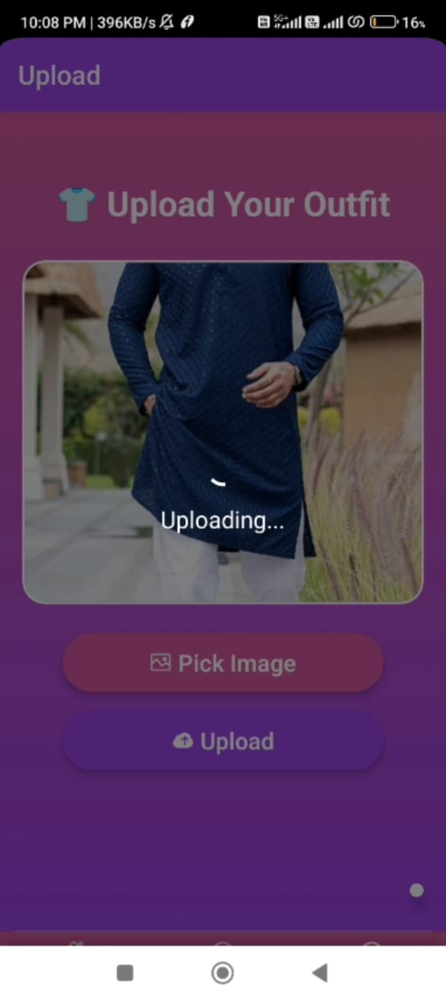
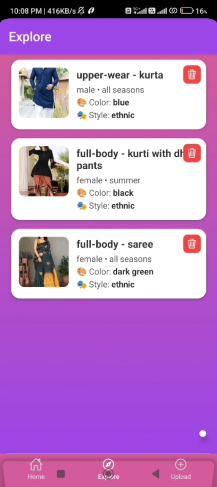

# 👗 Daily Dresser — Your AI Fashion Companion


**Daily Dresser** is a smart virtual stylist built during the **Meesho "Scripted By Her" Hackathon** under the *Smart Fashion* theme. It's your intelligent wardrobe assistant designed to suggest, visualize, and even help you shop personalized outfits — all powered by **Generative AI** and **virtual try-on technology**.

> 💡 “I have nothing to wear…” — Daily Dresser ends that struggle by making the most of what you already own.

---

## 🧠 Powered by AI · 📱 Built with React Native · ✨ Styled for Smart Fashion

---

## 📸 Features at a Glance

| Feature | Description |
|--------|-------------|
| 🧺 **Upload Your Clothes** | Digitize your wardrobe by uploading images of your garments |
| 🤖 **AI Outfit Recommendations** | Get suggestions using Gemini AI based on occasion, season, and your style |
| 🧍 **Virtual Try-On** | Try outfits on your own avatar using VITON-HD (high-res virtual try-on) |
| 🛍️ **Shop Complete Looks** | Smart shopping suggestions via Meesho integration |
| 🧠 **Auto Tagging** | Classifies items by type, color, gender, season, and style using AI |
| 💬 **Fashion Chatbot** | Chat to get styling help, mix-and-match ideas, or curated links |

---

## 🧩 Problem We Solved

Every woman’s wardrobe dilemma:
> “So many clothes but nothing to wear…”

### 💥 Challenges:
- 🔄 Repeating the same outfits
- 👕 Clothes get lost in clutter
- 🛍 Impulsive buying due to decision fatigue
- 🚫 No visual tool to try combinations
- 😕 Limited self-expression

### 💡 Our Solution:
Daily Dresser lets you:
- Upload your closet
- Let AI generate outfit combos
- Try them virtually
- Shop what you need — **only what you need**

---

## 🧑‍💻 Tech Stack

| Layer | Tech |
|-------|------|
| **Frontend** | React Native (Expo), Tailwind CSS (Nativewind), Lottie |
| **ML Backend** | Gemini API (chat & outfit logic), VITON-HD (virtual try-on) |
| **Backend** | Node.js, Express.js, MongoDB, Ngrok |
| **Media Handling** | Expo Image Picker, Document Picker |
| **Communication** | Axios, React Navigation |

---

## ⚙️ Architecture & Workflow

[User Uploads Clothes]
↓
AI (Gemini API) Tags:
- Type, Style, Color
- Season, Gender
↓
Saved in MongoDB → Wardrobe Closet
↓
User Requests: "Outfit for college"
↓
AI Suggests + VITON Virtual Try-on
↓
User Tries, Shops or Shares!

yaml
Copy
Edit

---

## 🧪 How It Works

### 🧺 Upload
- Upload your clothes via camera or gallery
- No manual tagging — AI auto-classifies everything

### 👀 Explore
- Browse your personal closet
- Filter by type, color, season, or style

### 💬 Chatbot
- Type: “Suggest outfit for brunch”
- Gemini AI parses query → fetches matching looks from your closet
- Displays ready-to-wear outfits, with shopping links if needed

### 🧍‍♀️ Virtual Try-On
- Select any two clothing items (top/bottom)
- Upload your image
- See yourself virtually styled via **VITON-HD**

---

## 🎯 Why It Matters

- 🧠 Eliminate decision fatigue
- 👗 Maximize wardrobe reuse
- 💸 Reduce unnecessary purchases
- 🌿 Promote sustainable fashion
- 🧍‍♀️ Encourage body-positive self-expression

---

## 🔮 Scalability & Future Scope

| Vision | Description |
|--------|-------------|
| 🛍️ Integration | Can plug into e-commerce like Meesho, Myntra, etc. |
| 📦 AR Try-On | Real-time live try-on via phone camera |
| 🧍‍♀️ Body-Type Analysis | Personalized suggestions by body shape |
| 🧣 Accessories | Recommend jewelry, shoes, bags for complete look |
| 🌐 Multilingual | Built for Bharat — adaptable to local styles |

---
---

## 📡 Backend Deployment

Our backend powers the AI logic, wardrobe storage, chatbot handling, and virtual try-on processing.

- 🔗 **Live Backend URL**: [https://mergedfolder-pq21.onrender.com](https://mergedfolder-pq21.onrender.com)  
- 📂 **Backend Source Code**: [GitHub – mergedFolder](https://github.com/MuskanScripts/mergedFolder)

### 🔧 Backend Features
- **Node.js + Express.js** server
- **REST API Endpoints**:
  - `POST /upload` – Garment image upload
  - `POST /chat` – Gemini AI-powered outfit suggestions
  - `POST /tryon` – Virtual try-on image generation using VITON-HD
- **MongoDB** – Stores user wardrobe data with metadata (type, style, season, etc.)
- Integrated seamlessly with the **React Native Expo frontend**

---
## 🖼️ App Preview

Here’s how Daily Dresser looks in action:

<p align="center">
  
  
  
  
</p>
> 🧠 Powered by Gemini AI | 👗 Virtual Try-On | 🎯 Personalized Recommendations

---


## 🚀 Getting Started

### 1. Clone the Repo
```bash
git clone https://github.com/MuskanScripts/FrontEndMeesho.git
cd FrontEndMeesho
```

### 2. Install Dependencies

```bash
npm install
```

### 3. Run the App

```bash
npx expo start
```

> 📱 Scan the QR with Expo Go app on your phone.

---

## 📦 Folder Structure

```bash
├── app/            # Expo Router pages
├── components/     # UI elements
├── assets/         # Images & animations
├── context/        # Chat + user data context
├── utils/          # Axios instances & helpers
└── app.config.js   # App metadata
```

---

## ✅ Prerequisites

* Node.js ≥ 16
* npm ≥ 8
* Expo Go (Android/iOS)
* Gemini API Key (for AI chat)
* VITON server (Python backend)

---

## 📺 Demo & Links

🎬 **Demo Video**: [https://shorturl.at/ldkU7](https://shorturl.at/ldkU7)

🖥️ **Slide Deck**: [https://shorturl.at/QNuHy](https://shorturl.at/QNuHy)

📂 **GitHub Code**:
Frontend & Merged Backend : [https://github.com/muskan1712/DailyDresser.git](https://github.com/muskan1712/DailyDresser.git)

 🌐 **Deployed app / hosted instance link** : [https://frontmeesho.netlify.app/](https://frontmeesho.netlify.app/)

---

## 👩‍💻 Team BugBusters

* **Muskan Jain** – [GitHub](https://github.com/muskan1712) – Team Leader, IET Lucknow
* **Muskan** – [GitHub](https://github.com/MuskanScripts) – AI & React Native Dev, NIT Jalandhar

---
